# Statistics Practicals
This file is a compilation of all the code and output from each excercise. I did NOT do the excercises in anaconda. If you wish to further inspect the code it is available at [https://github.com/jacobwindsor/BIST_SDA_Practicals](https://github.com/jacobwindsor/BIST_SDA_Practicals).

## Practical 1
### Excercise 1
#### Code
```python
import pandas as pd # Read data and work with data frames
import matplotlib.pyplot as plt # Boxplot and histogram
import statsmodels.api as sm # QQ plot
import scipy.stats as stats # Basic statistics
import numpy as np # Scientific computing
from pathlib import Path

data = pd.read_table(Path.cwd() / "Practical1/spider_web.txt", sep=' ')

def ttest(keyword, human_readable):
    result = stats.ttest_ind(data[keyword + 'DIM'], data[keyword + 'LIG'], equal_var = True)
    print(f"The test statistic for {human_readable} is {result.statistic} with a pvalue of {result.pvalue}.")
 
ttest("HORIZ", "web width")
ttest("VERT", "web height")
```

#### Output
The test statistic for web width is 2.1405166251313874 with a pvalue of 0.04003367486004684.

The test statistic for web height is 0.8887858861631696 with a pvalue of 0.38075080527784877.

### Excercise 2
#### Code
```python
import pandas as pd # Read data and work with data frames
import matplotlib.pyplot as plt # Boxplot and histogram
import statsmodels.api as sm # QQ plot
import scipy.stats as stats # Basic statistics
import numpy as np # Scientific computing
from pathlib import Path

def sample_from_simulated(distribution, sampleSize = 100, numSamples = 1000, showGraph = True, prefix=""):    
    print(f"number of samples = {numSamples}, sample size = {sampleSize}")
    print(f"===================================================== \n")

    samples = np.fromiter(_doSampling(distribution, sampleSize, numSamples), dtype=float)

    plt.hist(np.fromiter(samples, dtype=float))
    showGraph and plt.savefig(Path.cwd() / f"Practical1/graphs/{prefix}_hist_sampleSize{sampleSize}_numSamples{numSamples}.png")

    sample_mean = np.mean(samples)
    pop_mean = np.mean(distribution)
    similiar_text = ("not ", "")[abs(pop_mean - sample_mean) < 10]
    print(f"The mean of the population is {pop_mean} and the mean of the sampling distribution of the mean is {sample_mean}. They are {similiar_text}similiar.")

    sample_std = np.std(samples)
    pop_std = np.std(distribution)
    similiar_std_text = ("not ", "")[abs(pop_std - sample_std) < 5]
    print(f"The std of the population is {pop_std} and the std of the sampling distribution of the mean is {sample_std}. They are {similiar_std_text}similiar.")

    estimated_std = pop_std / np.sqrt(numSamples)
    clt_holds_txt = ("not ", "")[abs(estimated_std - sample_std) < 1]
    print(f"The estimated std of the population is {estimated_std}. So, the CLT does {clt_holds_txt}estimate the sample standard deviation.")

    print("\n")

def binomial(sampleSize = 100, numSamples = 1000):
    np.random.seed(10)
    distribution = np.random.binomial(1000, 0.5, sampleSize)

    sample_from_simulated(distribution, sampleSize, numSamples, True, "binomial")

print(f"Performing simulated binomial sampling.")
print("======================================================\n\n")
binomial()
binomial(3, 10)
binomial(10, 50)
```

#### Output
```
Performing simulated binomial sampling.
======================================================


number of samples = 1000, sample size = 100
===================================================== 

The mean of the population is 500.59 and the mean of the sampling distribution of the mean is 500.52718. They are similiar.
The std of the population is 14.492132348277808 and the std of the sampling distribution of the mean is 0.4474437479728617. They are not similiar.
The estimated std of the population is 0.45828146373162426. So, the CLT does estimate the sample standard deviation.


number of samples = 10, sample size = 3
===================================================== 

The mean of the population is 502.6666666666667 and the mean of the sampling distribution of the mean is 503.0333333333333. They are similiar.
The std of the population is 11.953614051360738 and the std of the sampling distribution of the mean is 3.439315177312038. They are not similiar.
The estimated std of the population is 3.7800646672892895. So, the CLT does estimate the sample standard deviation.


number of samples = 50, sample size = 10
===================================================== 

The mean of the population is 497.2 and the mean of the sampling distribution of the mean is 496.912. They are similiar.
The std of the population is 14.323407415835103 and the std of the sampling distribution of the mean is 1.8057065099290144. They are not similiar.
The estimated std of the population is 2.025635702686937. So, the CLT does estimate the sample standard deviation.


```

#### Graphs
sampleSize = 3 and numSamples = 10
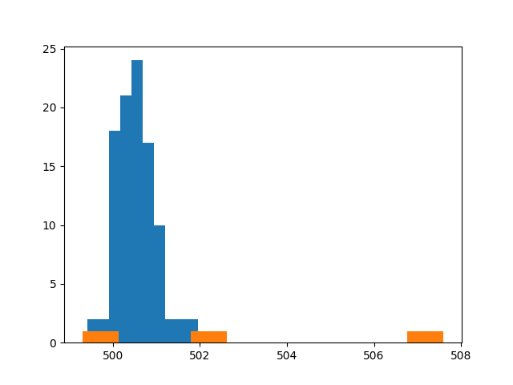

sampleSize = 10 and numSamples = 50
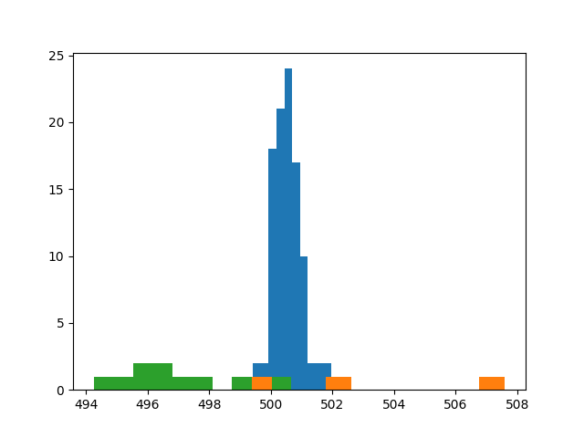

sampleSize=199 and numSamples = 1000
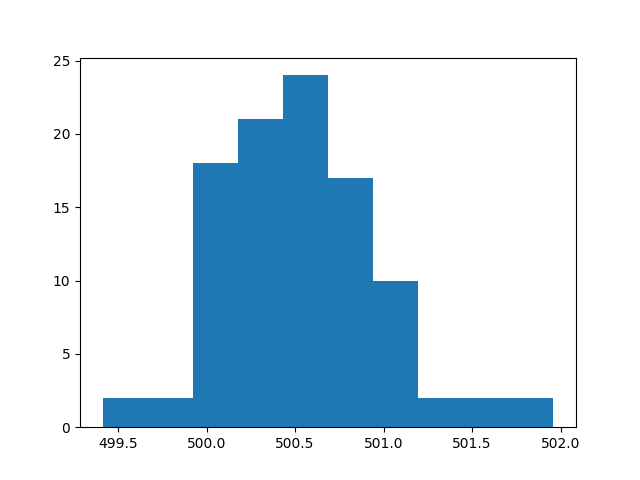

### Excercise 3
#### Code
```python
import pandas as pd # Read data and work with data frames
import matplotlib.pyplot as plt # Boxplot and histogram
import statsmodels.api as sm # QQ plot
import scipy.stats as stats # Basic statistics
import numpy as np # Scientific computing
from pathlib import Path

data = pd.read_table(Path.cwd() / "Practical1/spider_web.txt", sep=' ')

def uniform(sampleSize = 100, numSamples = 1000):

    np.random.seed(10)
    distribution = np.random.uniform(low=0, high=9, size=sampleSize)

    sample_from_simulated(distribution, sampleSize, numSamples, True, "uniform")

print(f"Performing simulated uniform sampling.")
print("======================================================\n\n")
uniform()
uniform(100, 10)
uniform(100, 100)
uniform(3)
uniform(10)
uniform(50)
```

#### Output
```
Performing simulated uniform sampling.
======================================================


number of samples = 1000, sample size = 100
===================================================== 

The mean of the population is 4.368139120077659 and the mean of the sampling distribution of the mean is 4.367447605406357. They are similiar.
The std of the population is 2.4747893318776253 and the std of the sampling distribution of the mean is 0.06867074213907605. They are similiar.
The estimated std of the population is 0.07825971017819644. So, the CLT does estimate the sample standard deviation.


number of samples = 10, sample size = 100
===================================================== 

The mean of the population is 4.368139120077659 and the mean of the sampling distribution of the mean is 4.413177512272377. They are similiar.
The std of the population is 2.4747893318776253 and the std of the sampling distribution of the mean is 0.7447020635792081. They are similiar.
The estimated std of the population is 0.7825971017819643. So, the CLT does estimate the sample standard deviation.


number of samples = 100, sample size = 100
===================================================== 

The mean of the population is 4.368139120077659 and the mean of the sampling distribution of the mean is 4.407118822941545. They are similiar.
The std of the population is 2.4747893318776253 and the std of the sampling distribution of the mean is 0.23321174815478812. They are similiar.
The estimated std of the population is 0.24747893318776254. So, the CLT does estimate the sample standard deviation.


number of samples = 1000, sample size = 3
===================================================== 

The mean of the population is 4.2771624826572685 and the mean of the sampling distribution of the mean is 4.26237341718008. They are similiar.
The std of the population is 2.9362459396963705 and the std of the sampling distribution of the mean is 0.04971967465653465. They are similiar.
The estimated std of the population is 0.09285224939861943. So, the CLT does estimate the sample standard deviation.


number of samples = 1000, sample size = 10
===================================================== 

The mean of the population is 3.7024853360576406 and the mean of the sampling distribution of the mean is 3.744565806242656. They are similiar.
The std of the population is 2.574487367623927 and the std of the sampling distribution of the mean is 0.030818211330529404. They are similiar.
The estimated std of the population is 0.08141243889022842. So, the CLT does estimate the sample standard deviation.


number of samples = 1000, sample size = 50
===================================================== 

The mean of the population is 4.516457913399573 and the mean of the sampling distribution of the mean is 4.513502661396559. They are similiar.
The std of the population is 2.4669922800506283 and the std of the sampling distribution of the mean is 0.07067587936566191. They are similiar.
The estimated std of the population is 0.07801314575011957. So, the CLT does estimate the sample standard deviation.

```
#### Graphs
sampleSize = 3 numSamples = 100


sampleSize = 10 numSamples = 1000
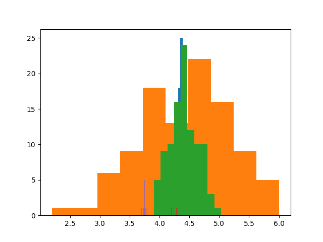

sampleSize = 50 numSamples = 1000


sampleSize = 100 numSamples = 10
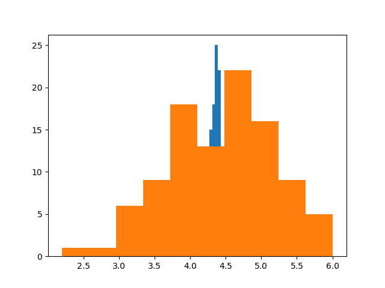

sampleSize = 100 numSamples = 100


sampleSize = 100 numSamples = 1000
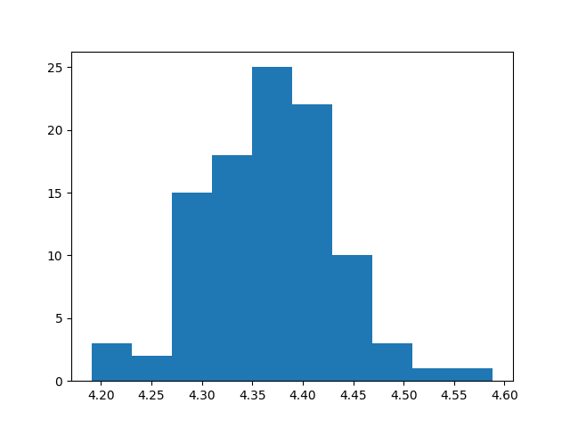

## Practical 2
### Excercise 1
#### Code
```python
import pandas as pd
import statsmodels as sm
import statsmodels.api as statsmodels
from statsmodels.formula.api import ols
from scipy import stats
import numpy as np
import matplotlib.pyplot as plt
from pathlib import Path
import math

np.random.seed(10)

""" Excercise 1
Normal distribution ANOVA
"""

def experiment():
    # Sample 4 (n=20) samples from normal distribution
    index_column = []
    data_column = []
    for i in range(1,5):
        index_column.extend([str(i)] * 20) # Convert i to string so is treated as a categorical variable
        data_column.extend(np.random.normal(loc=164, scale=math.sqrt(24), size=20))

    samples = pd.DataFrame(
        data={"index": index_column, "data": data_column}
    )

    sample_stats = []
    for i in range(1,5):
        sample = samples.loc[samples["index"] == str(i)]
        sample_stats.append({
            "sample_label": str(i),
            "mean": np.mean(sample["data"]),
            "variance": np.var(sample["data"])
        })

    # Calculate MSbetween and MSwithin
    mod = ols("data ~ index", data=samples).fit()
    return { 
        "a_tab": sm.stats.anova.anova_lm(mod),
        "sample_stats": sample_stats
    }

print("Performing ANOVA for one repeat of experiment \n")
one_experiment = experiment()
print(one_experiment["a_tab"])
print("\n")

for sample in one_experiment["sample_stats"]:
    print(f"Mean for sample {sample['sample_label']} is {sample['mean']} and the variance is {sample['variance']}")

print("Given the p value. Sample means are likely not statistically different. \n")
print("MSB and MSW are not similiar. Neither are good estimates of the variance of the normal distribution. Although, MSW is closer to 24. \n")

print("Performing ANOVA for 1000 repeats of experiment \n")

fvalues = []
for x in range(0, 999):
    anova = experiment()["a_tab"]
    fvalues.append(anova["F"]["index"])

plt.hist(
    fvalues,
    density=True, # plot a density function for probabilities
    bins=np.arange(min(fvalues), max(fvalues) + 0.3, 0.3)
)
plt.xlabel("F value")
plt.ylabel("Probability")
fig_path = Path.cwd() / "Practical2/graphs/fdist_ex1.png"
print(f"See {fig_path} for output f distribution \n")
plt.savefig(fig_path)

print("Using this distribution, given alpha of 0.5, the Fc would be approximately 3.5-4")

cdf = stats.f.cdf(3.5, dfn=3, dfd=26)

print(f"For a theoretical T distribution with the same degrees of freedom, {round(cdf * 100, 3)}% of F values lie to the left of 3.5.")
print("Therefore, the given Fc value of 3.5-4.0 is quite accurate.")
```

#### Output
```
Performing ANOVA for one repeat of experiment 

            df      sum_sq    mean_sq         F    PR(>F)
index      3.0    13.16976   4.389920  0.212692  0.887318
Residual  76.0  1568.62368  20.639785       NaN       NaN


Mean for sample 1 is 164.58160429173273 and the variance is 16.754929868230096
Mean for sample 2 is 165.10125605686122 and the variance is 27.51536000901266
Mean for sample 3 is 164.62928553522403 and the variance is 13.134380024925658
Mean for sample 4 is 163.95957171053294 and the variance is 21.026514082996627
Given the p value. Sample means are likely not statistically different. 

MSB and MSW are not similiar. Neither are good estimates of the variance of the normal distribution. Although, MSW is closer to 24. 

Performing ANOVA for 1000 repeats of experiment 

See /home/jacob/projects/BIST_SDA_Practicals/Practical2/graphs/fdist_ex1.png for output f distribution 

Using this distribution, given alpha of 0.5, the Fc would be approximately 3.5-4
For a theoretical T distribution with the same degrees of freedom, 97.047% of F values lie to the left of 3.5.
Therefore, the given Fc value of 3.5-4.0 is quite accurate.
```

#### Graphs
F distribution
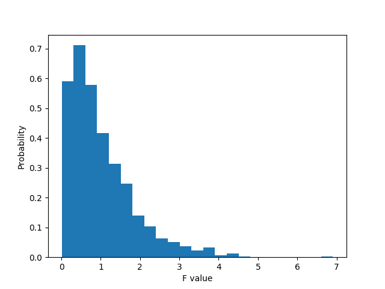

### Excercise 2
#### Code 
```python
import pandas as pd
import statsmodels as sm
import statsmodels.api as statsmodels
from statsmodels.formula.api import ols
from scipy import stats
import numpy as np
import matplotlib.pyplot as plt
from pathlib import Path
from statsmodels.stats.multicomp import MultiComparison
from statsmodels.sandbox.stats.multicomp import tukeyhsd
from pathlib import Path

"""Excercise 2
Zinc contamination
"""

data = pd.read_table(Path.cwd() / "Practical2/contamination.txt", sep=' ')
print(data.head())

# Make box plot
data.boxplot(column="DIVERSITY", by="ZINC")
print("See boxplot in graphs folder")
plt.savefig(Path.cwd() / "Practical2/graphs/boxplot_ex2.png")

# h0 = group means are all equal
mod = ols("DIVERSITY ~ ZINC", data=data).fit()
results = sm.stats.anova.anova_lm(mod)
print("ANOVA TABLE for diversity versus zinc level groups")
print(results)

print("P is below alpha of 0.05. So reject null hypothesis. The means are not equal.")

# Perform post hoc test
print("Performing post hoc test...")
mc = MultiComparison(data["DIVERSITY"], data["ZINC"])
print(mc.tukeyhsd())
print("Can conclude that group2 with LOW zinc contamination is the group with a significantly different mean")
```

#### output
```
  STREAM  ZINC  DIVERSITY
0  Eagle  BACK       2.27
1  Eagle  HIGH       1.25
2  Eagle  HIGH       1.15
3  Eagle   MED       1.62
4   Blue  BACK       1.70
See boxplot in graphs folder
ANOVA TABLE for diversity versus zinc level groups
            df    sum_sq   mean_sq        F   PR(>F)
ZINC       3.0  2.566612  0.855537  3.93869  0.01756
Residual  30.0  6.516411  0.217214      NaN      NaN
P is below alpha of 0.05. So reject null hypothesis. The means are not equal.
Performing post hoc test...
Multiple Comparison of Means - Tukey HSD, FWER=0.05
===================================================
group1 group2 meandiff p-adj   lower  upper  reject
---------------------------------------------------
  BACK   HIGH  -0.5197 0.1221 -1.1355  0.096  False
  BACK    LOW    0.235 0.7239 -0.3986 0.8686  False
  BACK    MED  -0.0797    0.9 -0.6955  0.536  False
  HIGH    LOW   0.7547 0.0117   0.139 1.3705   True
  HIGH    MED     0.44 0.2096 -0.1574 1.0374  False
   LOW    MED  -0.3147 0.5139 -0.9305  0.301  False
---------------------------------------------------
Can conclude that group2 with LOW zinc contamination is the group with a significantly different mean
```

#### Graphs
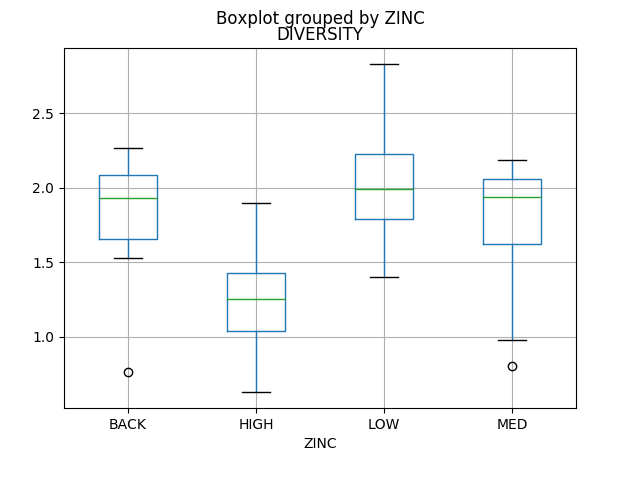

### Excercise 3
#### Code
```python
import pandas as pd
import statsmodels as sm
import statsmodels.api as statsmodels
from statsmodels.formula.api import ols
from scipy import stats
import numpy as np
import matplotlib.pyplot as plt
from pathlib import Path
from statsmodels.stats.multicomp import MultiComparison
from statsmodels.sandbox.stats.multicomp import tukeyhsd
import math

"""Excercise 3
Confidence intervals
"""
data = pd.read_table(Path.cwd() / "Practical2/fertilizer.txt", delim_whitespace = True)
stats = data.groupby("fertilizer").agg(["mean", "count", "std"])

ci95_hi = []
ci95_lo = []

for i in stats.index:
    m, c, s = stats.loc[i]
    ci95_hi.append(m + 1.96*s/math.sqrt(c))
    ci95_lo.append(m - 1.96*s/math.sqrt(c))

stats['ci95_hi'] = ci95_hi
stats['ci95_lo'] = ci95_lo
print(stats[["ci95_hi", "ci95_lo"]])
```

#### Output
```
              ci95_hi   ci95_lo
                               
fertilizer                     
fertilizer1  6.049919  4.840081
fertilizer2  4.601297  3.396703
fertilizer3  5.091134  3.882866

```

### Excercise 4
```python
import pandas as pd
import statsmodels as sm
import statsmodels.api as statsmodels
from statsmodels.formula.api import ols
from scipy import stats
import numpy as np
import matplotlib.pyplot as plt
from pathlib import Path
from statsmodels.stats.multicomp import MultiComparison
from statsmodels.sandbox.stats.multicomp import tukeyhsd
import math
from statsmodels.graphics.factorplots import interaction_plot

""""Ex 1 ANOVA 2 (ex 4, practical 2)
Limpets ANOVA
"""

# Create the data 
spring = [1.167, 0.5, 1.667, 1.5, 0.833, 1, 0.667, 0.667, 0.75]
summer = [4, 3.83, 3.83, 3.33, 2.58, 2.75, 2.54, 1.83, 1.63]
density = [6] * 3 + [12] * 3 + [24] * 3

data = {
    "DENSITY": density * 2,
    "SEASON": ["SPRING"] * len(spring) + ["SUMMER"] * len(summer),
    "EGGS": spring + summer
}
df = pd.DataFrame(data)
df["DENSITY"] = df["DENSITY"].astype(object)

# Look at dispesion of eggs of each factor
df.boxplot(column="EGGS", by="DENSITY")
print("See graphs/ex4_boxplot_eggs_density.png")
plt.savefig(Path.cwd() / "Practical2/graphs/ex4_boxplot_eggs_density.png")
df.boxplot(column="EGGS", by="SEASON")
print("See graphs/ex4_boxplot_eggs_season.png")
plt.savefig(Path.cwd() / "Practical2/graphs/ex4_boxplot_eggs_season.png")

# And together
df.boxplot(column="EGGS", by=["DENSITY", "SEASON"])
print("See graphs/ex4_boxplot_eggs_density_season.png")
plt.savefig(Path.cwd() / "Practical2/graphs/ex4_boxplot_eggs_density_season.png")

# Perform two way ANOVA
print("Performing two way ANOVA")
mod = ols('EGGS ~ DENSITY + SEASON + DENSITY:SEASON', data = df).fit()
print(sm.stats.anova.anova_lm(mod))
print("Both the density and season affect the eggs and there IS an interaction between the two factors.")

# Create interaction plot
print("Creating interaction plot")
interaction_plot(df['DENSITY'], df['SEASON'], df['EGGS'])
print("See graphs/ex4_interaction_plot.png")
plt.savefig(Path.cwd() / "Practical2/graphs/ex4_interaction_plot.png")

print("More eggs are laid during spring")
print("Lines are not parallel so an interaction occurs.")
```

### Output
```
See graphs/ex4_boxplot_eggs_density.png
See graphs/ex4_boxplot_eggs_season.png
See graphs/ex4_boxplot_eggs_density_season.png
Performing two way ANOVA
                  df     sum_sq    mean_sq           F        PR(>F)
DENSITY          2.0   4.001910   2.000955   13.984179  7.324696e-04
SEASON           1.0  17.148320  17.148320  119.845363  1.335587e-07
DENSITY:SEASON   2.0   1.690723   0.845362    5.908024  1.636324e-02
Residual        12.0   1.717045   0.143087         NaN           NaN
Both the density and season affect the eggs and there IS an interaction between the two factors.
Creating interaction plot
See graphs/ex4_interaction_plot.png
More eggs are laid during spring
Lines are not parallel so an interaction occurs.
```

#### Graphs
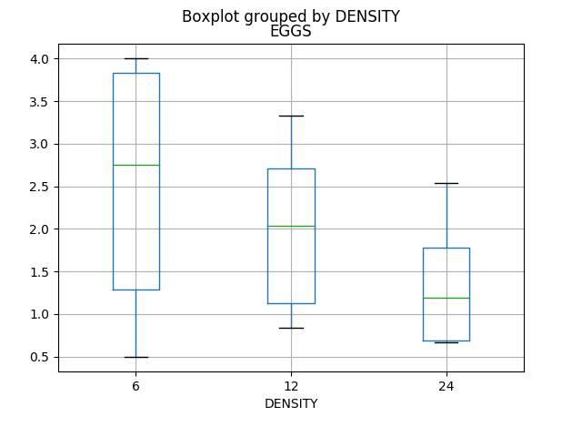
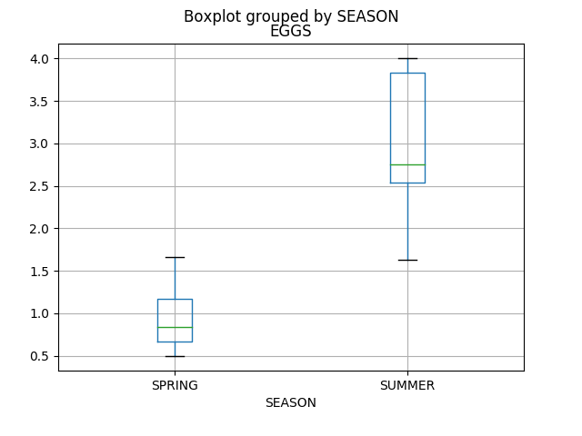
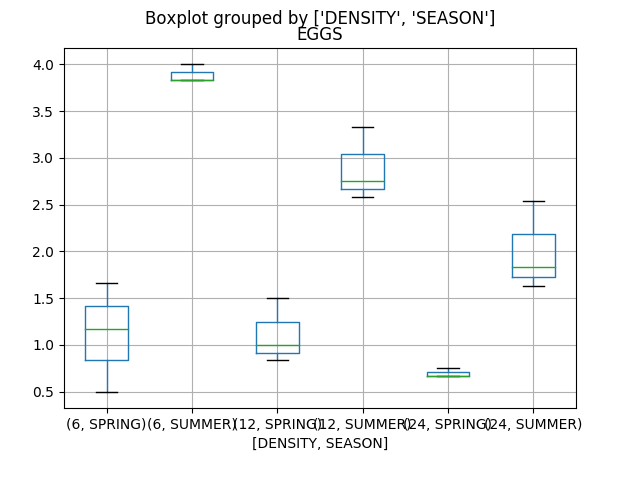
Interaction plot
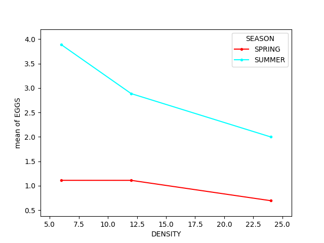

## Practical 3
### Excercise 1
#### Code 
```python
import pandas as pd
import numpy as np
import statsmodels.api as sm
from statsmodels.formula.api import ols
import matplotlib.pyplot as plt
import seaborn as sns # statistical data visualization
from scipy.stats import pearsonr
from pathlib import Path

droso = pd.read_table(Path.cwd() / "Practical3/droso_survival.txt", delim_whitespace = True)
droso_log = np.log(droso[['size', 'egg_rate', 'longv']])

def calc_residuals(var1, var2):
    print(f"Calculating residuals between {var1} and {var2}")
    mod = ols(f"{var1}~{var2}", data=droso_log).fit()
    return mod.resid

def pairwise(var1, var2):
    corr = pearsonr(droso_log[var1], droso_log[var2])
    print(f"Pairwise correlation between {var1} and {var2}: {corr}")
    return corr

# Compute pairwise correlations
longv_size = pairwise("longv", "size")
longv_eggrate = pairwise("longv", "egg_rate")
size_eggrate = pairwise("size", "egg_rate")

# Caluclate residuals of regrssion between survival and body size
resid1 = calc_residuals("longv", "size")
resid2 = calc_residuals("egg_rate", "size")

correlation = pearsonr(resid1, resid2)
print(f"Correlation between residuals: {correlation}")
print("The above value indicates the partial correlation between the effect of longevity on size and the effect of egg_rate on size.")
print("Given that the p value is two tailed. The p value for the lower tail is large so there is a low probability that the two are negatively partially correlated. However, there is a high probability that they are positively partially correlated.")
```

#### output
```
Pairwise correlation between longv and size: (0.8283311342065418, 3.1849171441815143e-07)
Pairwise correlation between longv and egg_rate: (0.449849448135042, 0.024054320056476213)
Pairwise correlation between size and egg_rate: (0.7704626852133368, 6.6250867952798715e-06)
Calculating residuals between longv and size
Calculating residuals between egg_rate and size
Correlation between residuals: (-0.5273750528566099, 0.00674732634080353)
The above value indicates the partial correlation between the effect of longevity on size and the effect of egg_rate on size.
Given that the p value is two tailed. The p value for the lower tail is large so there is a low probability that the two are negatively partially correlated. However, there is a high probability that they are positively partially correlated.

```
